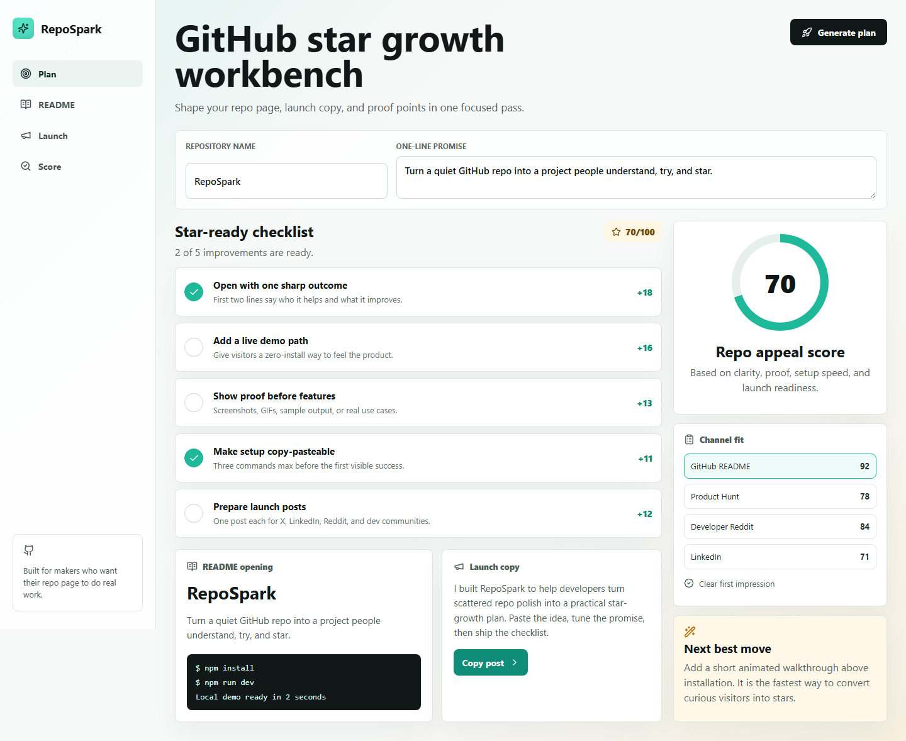

# RepoSpark

[](https://react.dev/)
[](https://vite.dev/)
[](LICENSE)
[](https://github.com/saiprasath00/repospark)

RepoSpark is a polished, interactive GitHub repository growth workbench. It helps makers improve the first impression of a repo by tuning the README promise, star-readiness checklist, launch copy, and appeal score in one place.



## What it does

RepoSpark turns a rough repository idea into a clear GitHub presentation plan:

- Score your repo appeal based on clarity, proof, setup speed, and launch readiness.
- Toggle high-impact improvements and watch the score update instantly.
- Draft a README opening that explains the project quickly.
- Generate launch copy for sharing the project with developer communities.
- Compare channel fit for GitHub, Product Hunt, Reddit, and LinkedIn.

## Why it is worth starring

- Practical GitHub growth workflow, not a static landing page.
- Interactive checklist with live score updates.
- README opening preview and launch post draft.
- Responsive React interface with focused developer-tool design.
- Small codebase that is easy to fork, customize, and extend.

## Quick start

```bash
git clone https://github.com/saiprasath00/repospark.git
cd repospark
npm install
npm run dev
```

## Run locally

```bash
npm install
npm run dev
```

Then open the local URL shown in your terminal.

## Share it

Want to help the project reach more makers? Use the ready-to-post copy in [docs/share-kit.md](docs/share-kit.md), or star the repo so more developers can discover it.

## Build

```bash
npm run build
```

## Roadmap

- GitHub API import for real repository metadata.
- Markdown export for generated README sections.
- Templates for CLI tools, SaaS apps, libraries, and games.
- Local save history for before and after score comparisons.
- Public demo deployment once GitHub Pages workflow access is enabled.

## Contributing

Ideas, design suggestions, and starter issues are welcome. See [CONTRIBUTING.md](CONTRIBUTING.md) for the quickest way to help.
